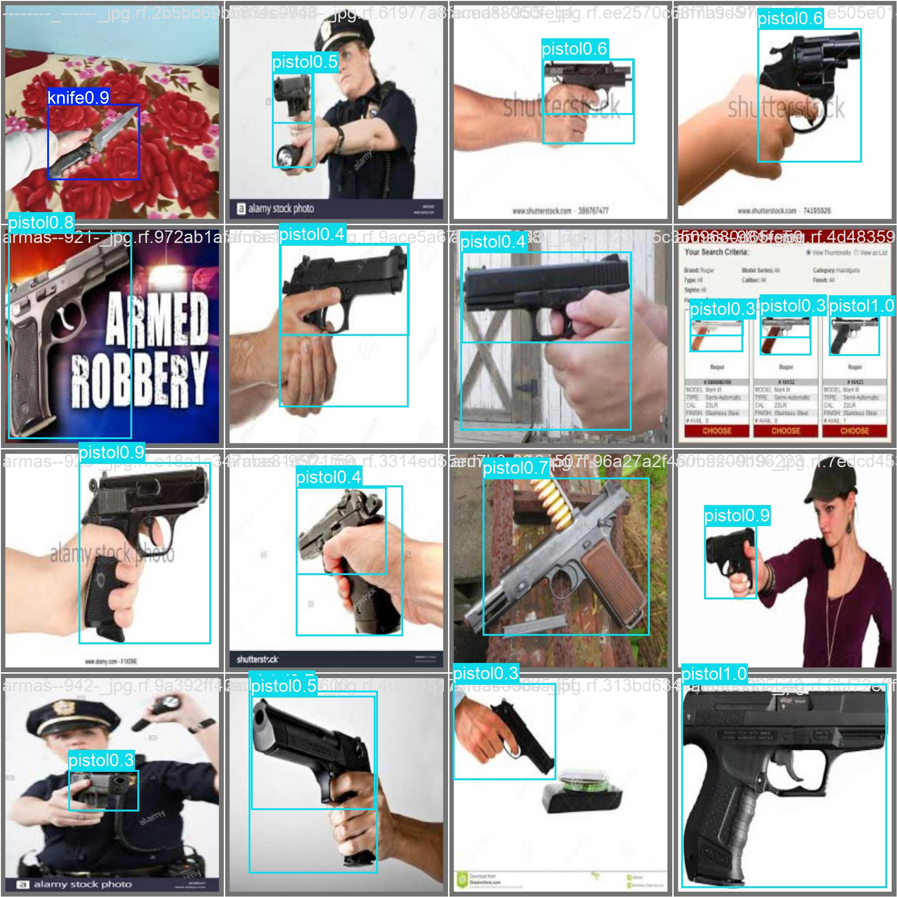
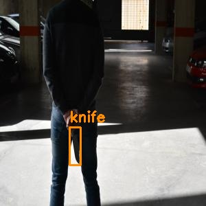
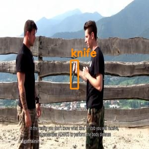
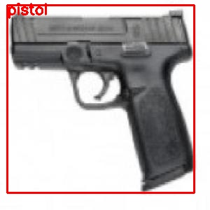
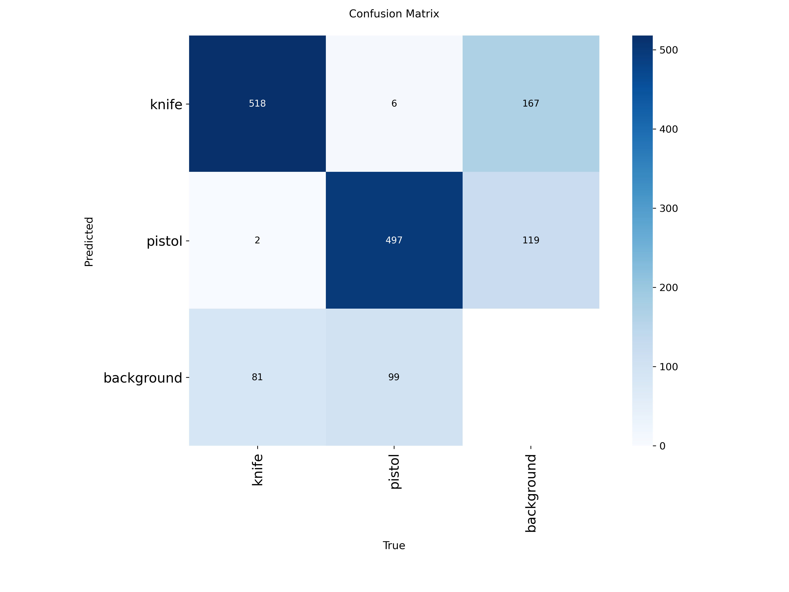
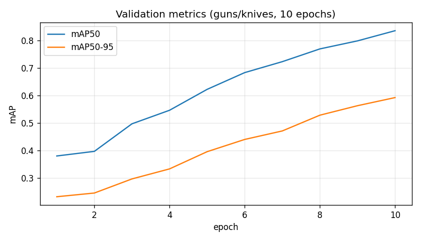

# AI Security Detection

Real-time camera system that spots knives and pistols, draws boxes on the feed, and raises alerts when something looks dangerous.



## Try it

There is no hosted web demo yet ;P. Run it on your machine (see **Quick start** below). Press **Q** in the video window to quit.

## Quick start

```powershell
cd code
python -m venv .venv
.\.venv\Scripts\Activate.ps1
pip install -r requirements.txt
pip install torch torchvision --index-url https://download.pytorch.org/whl/cu128
copy config.example.yaml config.yaml
```

Train or copy a weights file to `weapon_detection_custom.pt` (see **Train the weapon model**), then:

```powershell
python app.py
```

## Features

- Detects **knife** and **pistol** with a custom YOLO model (falls back to generic YOLO if weights are missing)
- Works with a **USB webcam** or an **ESP32-CAM** MJPEG stream
- On-screen boxes, FPS, and confidence scores
- Sound and visual alerts for high-confidence threats
- Saves incident frames under `detections/` when logging is on
- Kaggle guns/knives dataset pipeline to train your own weights

## Screenshots

**Train / val / test**





**Validation predictions**




**Training curve** (10-epoch)



## Run with your webcam

Edit `config.yaml`:

```yaml
detection:
  use_remote_stream: false
  camera_index: 0
```

Then:

```powershell
python app.py
```

Use `camera_index: 1` if you have more than one camera.

## Run with ESP32-CAM

1. Flash your ESP32 with a sketch that serves `http://<ip>:80/stream`.
2. Set your board IP in `config.yaml`:

```yaml
detection:
  use_remote_stream: true
  remote_stream_url: "http://YOUR_ESP32_IP:80/stream"
```

3. Test the stream only:

```powershell
python fetch_video.py
```

4. Run the full app:

```powershell
python app.py
```

Offline config check (no camera needed):

```powershell
python test_integration.py --offline
```

## Train the weapon model

Needs Python 3.10+, a GPU recommended, and Kaggle API token at `%USERPROFILE%\.kaggle\kaggle.json`.

```powershell
cd weapon_training
py download_kaggle_dataset.py
py prepare_dataset.py
py train_max_accuracy.py
```

Or one shot:

```powershell
cd weapon_training
.\run_full_training.ps1
```

`weapon_detection_custom.pt` at the project root. Validate:

```powershell
cd weapon_training
py test_trained_model.py
```

Default training preset in `config.yaml` is **15 epochs**, YOLOv8n, batch 16

## How it works

Video frames go through **Ultralytics YOLO**. A model trained on the [guns/knives Kaggle dataset](https://www.kaggle.com/datasets/iqmansingh/guns-knives-object-detection) handles weapon classes; general YOLO weights are only a fallback. `paths.py` picks deployed weights (`weapon_detection_custom.pt`) or the best checkpoint under `weapon_training/models/`. Per-class thresholds in `config.yaml` cut down false alarms before the alert system fires.

## Project layout

| Path | Purpose |
|------|---------|
| `app.py` | Main live detection app (webcam or ESP32) |
| `detection_system.py` | Alternate entry point with the same idea |
| `weapon_detector.py` | Weapon detection logic |
| `weapon_training/` | Download, prepare, train, test |
| `config.yaml` | Your local settings (copy from `config.example.yaml`) |

## Credits

- Dataset: [iqmansingh/guns-knives-object-detection](https://www.kaggle.com/datasets/iqmansingh/guns-knives-object-detection) on Kaggle
- Detection: [Ultralytics YOLO](https://github.com/ultralytics/ultralytics)